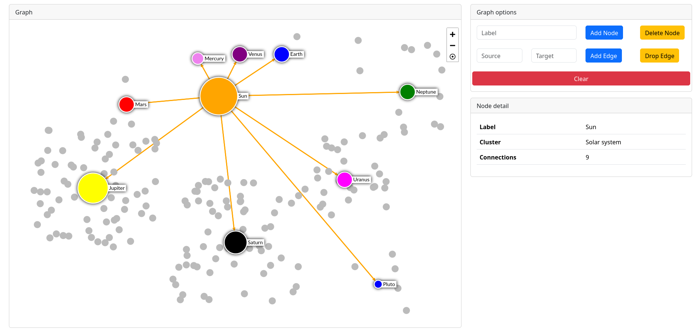
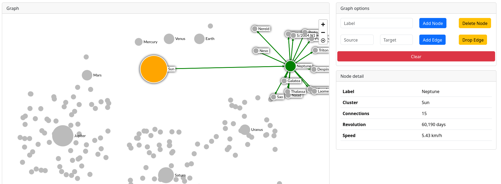
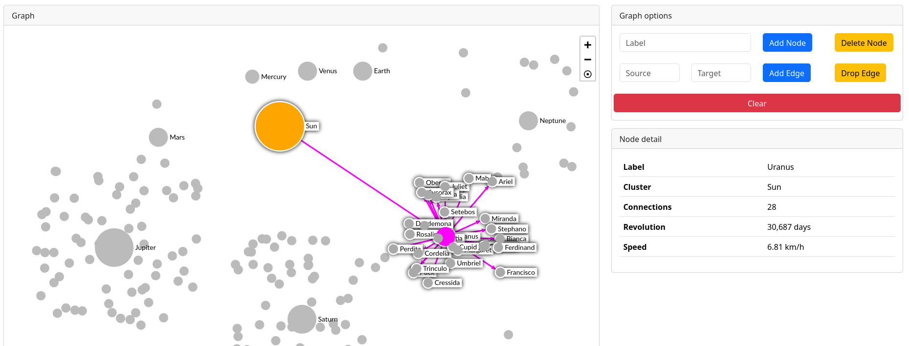
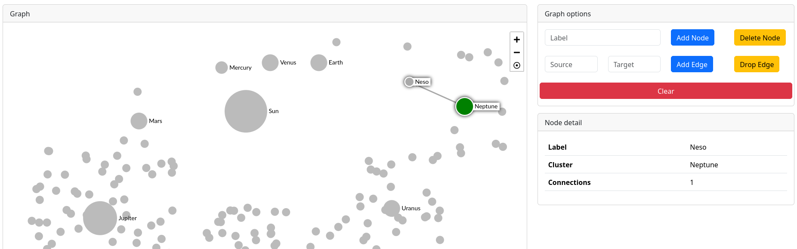

## ReSolGraph - React Solar System Graph

Using Sigma, Graphology and React-Sigma

## Functionalities

1. Graph node, edge ops
2. Node domain data display

## Screens

## Quick run
$ npm i  
$ npm start